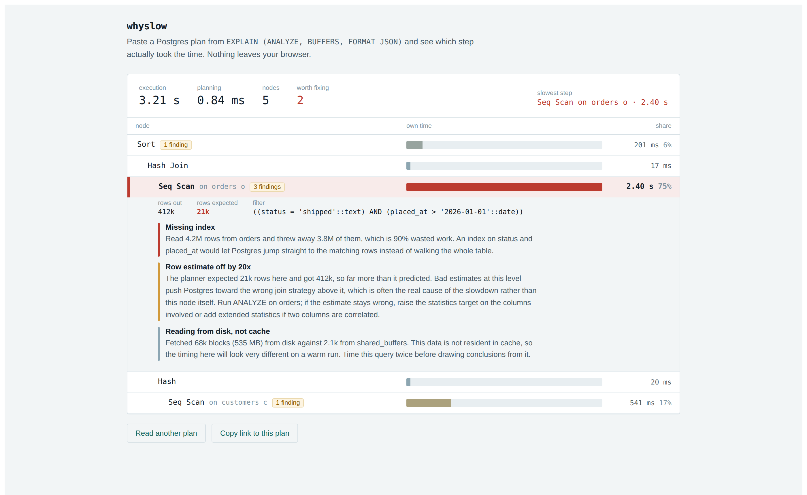

# whyslow

Paste a Postgres query plan and see which step actually took the time.



**[Try it without installing anything](https://tkk776.github.io/whyslow/)** · no signup, no upload, runs entirely in your browser.

---

## What it does

`EXPLAIN ANALYZE` tells you everything about a slow query and makes none of it easy to see. Three things in particular stay hidden in the text output:

**Which step is actually slow.** Every node's reported time includes all of its children, so the number at the top is always the biggest and always tells you nothing. whyslow subtracts the children out and draws what remains, so the long red bar is the step to fix.

**How long a step really ran.** Times inside a loop are reported per iteration. An index scan showing `0.031 ms` that ran 48,219 times cost you a second and a half. whyslow multiplies it out. This is the most commonly missed number in the entire plan format.

**Why it was slow.** A sequential scan reading four million rows to return four hundred thousand is a missing index. A sort that spilled to disk is `work_mem` set too low. whyslow says so, in a sentence, naming your table and your numbers.

## What it catches

|                    |                                                                                                                             |
| ------------------ | --------------------------------------------------------------------------------------------------------------------------- |
| Missing index      | A scan reading far more rows than it returns                                                                                |
| Stale statistics   | Row estimates off by 10x or more, reported at the node where the error starts rather than on every parent that inherited it |
| `work_mem` too low | Sorts spilling to disk, hash joins splitting into batches, bitmap scans going lossy                                         |
| Wrong index        | An index scan that finds rows and then filters most of them away                                                            |
| Bad join choice    | A nested loop running its inner side tens of thousands of times                                                             |
| Misleading timings | Heavy disk reads, meaning the numbers will look different on a warm cache                                                   |

## Sharing a plan

After reading a plan, click **Copy link to this plan**. The plan is compressed into the part of the URL after `#`, which browsers never send to a server, so the link carries the whole analysis while the plan still goes nowhere. Paste it into a ticket or a Slack thread and the recipient sees exactly what you saw.

## Getting a plan to paste

```sql
EXPLAIN (ANALYZE, BUFFERS, FORMAT JSON)
SELECT ...;
```

`FORMAT JSON` is the part that matters. `BUFFERS` is optional but enables the cache diagnostics. `ANALYZE` runs the query for real, so do not use it on a statement that writes anything you care about.

## Running it yourself

```bash
git clone https://github.com/TKK776/whyslow
cd whyslow
npm install
npm run dev
```

There is no backend and no build step beyond Vite. `npm run build` produces a static `dist/` you can host anywhere.

## How the timing math works

For each node:

```
inclusive = "Actual Total Time" × "Actual Loops"
exclusive = inclusive − sum(children's inclusive)
```

The multiplication is the part tools get wrong. Postgres reports an average per loop, so on a nested loop the headline number can be three orders of magnitude smaller than the time actually spent. The subtraction is the part readers get wrong, since it is what separates "this subtree was slow" from "this node was slow."

Rounding inside Postgres occasionally makes children sum to slightly more than their parent. Those cases are clamped to zero and recorded as a warning rather than shown as negative time.

## Roadmap

Roughly in order.

- Text format input, so you can paste the default `EXPLAIN` output
- Dark mode
- More rules: trigger overhead, JIT costing more than it saves, partition pruning that failed
- MySQL and SQLite

**Not planned:** accounts, saved history, anything requiring a server. Plans contain your schema, and the strongest privacy guarantee is having nowhere to send them.

## Contributing

The most useful contribution is a plan that whyslow reads wrong. Open an issue with the JSON attached and it becomes a permanent test fixture, which means that case can never break again.

```bash
npm run verify           # typecheck, lint, format, test
npm run test:watch
npm run fixtures:generate    # regenerate the corpus against a real Postgres
```

Each diagnostic rule is a single function in `src/diagnostics/rules.ts` with a stable id and its own tests. Adding one is small and self-contained. The bar for a new rule is that it ends in something the reader can actually go and do.

## Prior art

[pev2](https://github.com/dalibo/pev2) is the established Postgres plan visualizer and handles the text format, which whyslow does not yet. [explain.depesz.com](https://explain.depesz.com) has been running for over a decade. [pgMustard](https://www.pgmustard.com) is a commercial tool with a deeper rule set than this one. whyslow's angle is the plain-English diagnosis and a client-side-only guarantee.

## License

MIT
